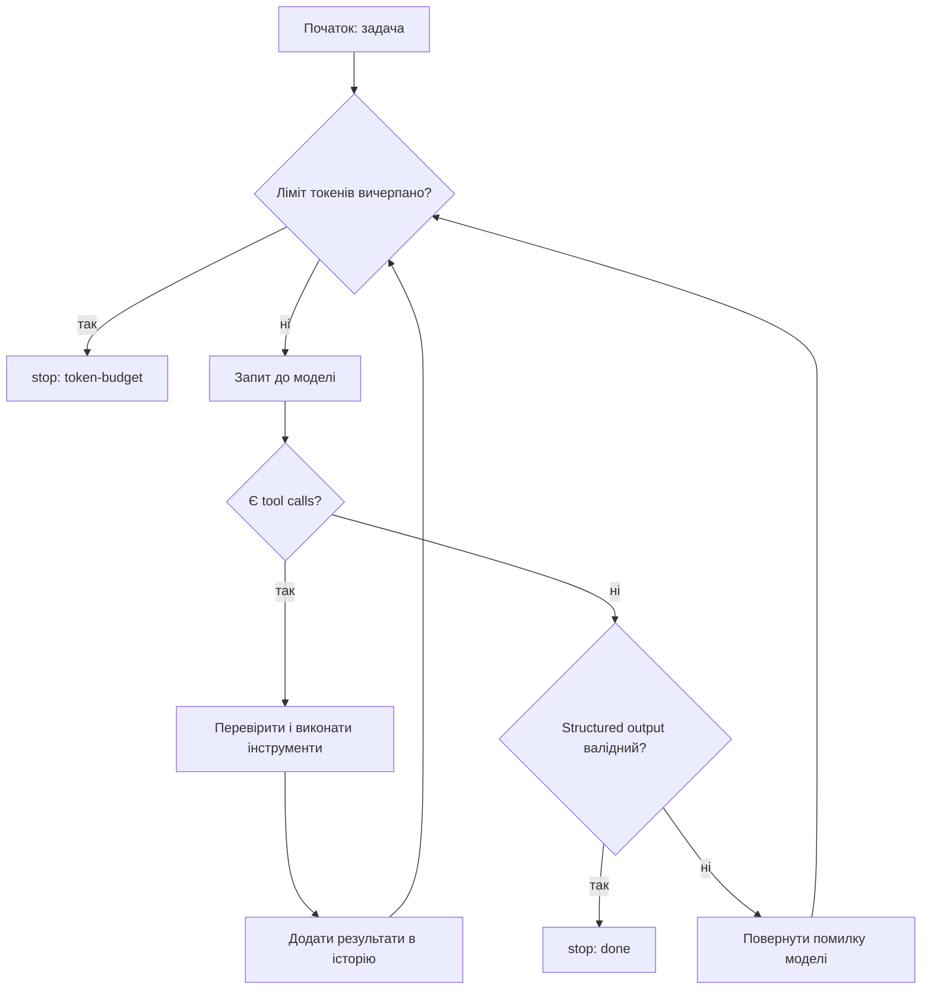
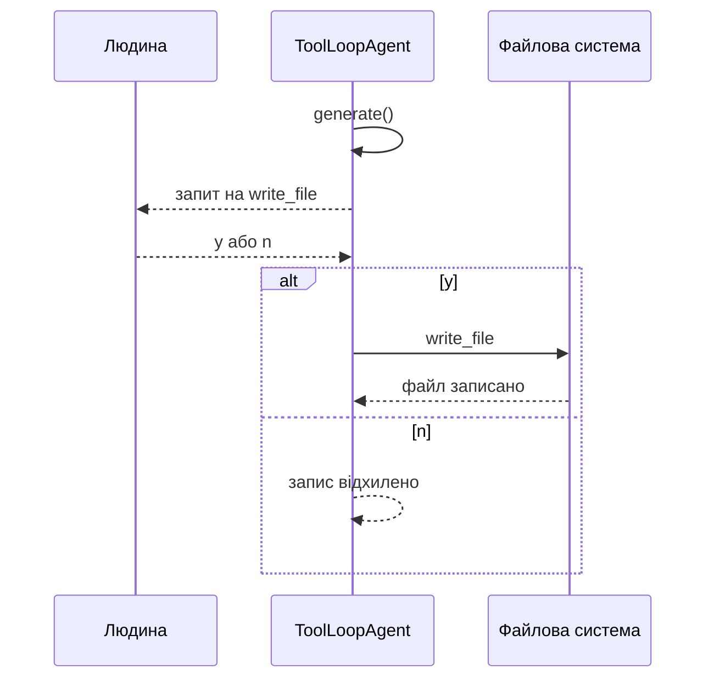
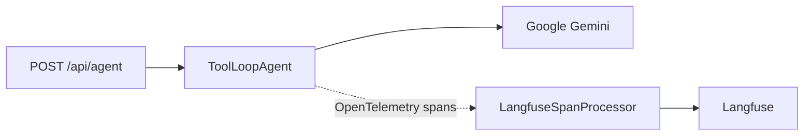

# Звіт · Лабораторна 1 — агентно-готовий репозиторій і власний агентний цикл

Автор: AdamT3H  
Репозиторій: [AdamT3H/AI-Lab1](https://github.com/AdamT3H/AI-Lab1)  
Деплой: `https://ai-lab1-delta.vercel.app/api/agent`  
Період роботи: **2026-09-14 — 2026-10-05**

Цей звіт описує розвиток репозиторію від початкового шаблону до агентно-готового Next.js-проєкту з endpoint `/api/health`, власним агентним циклом, реалізацією на AI SDK 7, підтримкою Gemini та Ollama, трасуванням через OpenTelemetry/Langfuse і пакетом доказів лабораторної роботи.

Звіт складено за історією комітів гілки `main`.

---

## Коротко

- Репозиторій створено на основі стартового шаблону курсу «Агентна інженерія».
- Налаштовано `AGENTS.md` як головну карту проєкту для агентів.
- Додано журналювання дій агентів у `.agent-log/` для Copilot CLI і Codex.
- Реалізовано endpoint `/api/health` із контрактом Zod та модульним тестом.
- Створено навичку `add-api-route` для повторюваної процедури додавання API-маршрутів.
- Додано захист `.env` і `.env.local` через pre-tool hooks.
- Проведено тести роботи навички, журналювання, MCP Context7 та порівняння агентів.
- Додано посилання на `/api/health` на головній сторінці та e2e-тест зі скріншотом.
- Реалізовано власний агентний цикл із `list_files`, `read_file`, лімітами кроків, бюджетом токенів і підтримкою різних форматів API.
- Реалізовано альтернативний варіант на AI SDK 7 з `ToolLoopAgent` і підтвердженням людини перед виконанням `write_file`.
- Додано OpenTelemetry та інтеграцію з Langfuse для трасування викликів моделей.
- Проведено вимірювання вартості, кешування, затримки та співвідношення токенізації українського й англійського тексту.
- Виявлено, що формально валідний structured output не гарантує правильності виконаного завдання.
- Задокументовано сильні та слабкі сторони Copilot CLI, Codex, власного циклу та AI SDK.

---

## 1. Що було на старті

### Початковий шаблон

Початковий стан репозиторію було створено комітом [`5ffe8e9`](https://github.com/AdamT3H/AI-Lab1/commit/5ffe8e9b915e0b9d1348f232e8c37a96df77f68c) — `Initial commit`.

На старті в репозиторії вже були:

- Next.js із App Router;
- TypeScript у strict-режимі;
- Vitest для модульних тестів;
- Playwright для e2e-тестів;
- базовий CI;
- `.env.example`;
- `.claude/settings.example.json`;
- скрипти `doctor`, `sync-skills` і `transcript-to-jsonl`;
- початкова структура `app/`, `src/`, `tests/`;
- порожня тека `.agent-log/`.

Початковий шаблон не містив готової реалізації `/api/health`, навички додавання API-маршрутів або повноцінного робочого журналу дій агентів.

---

## 2. Стан репозиторію після виконаної роботи

Основні складові репозиторію:

```text
AI-Lab1/
├─ AGENTS.md
├─ CLAUDE.md
├─ README.md
├─ package.json
├─ package-lock.json
├─ .env.example
├─ .agent-log/
│  ├─ copilot.jsonl
│  ├─ codex.jsonl
│  └─ agent-loop.jsonl
├─ .claude/
│  └─ skills/
│     └─ add-api-route/
├─ .agents/
│  └─ skills/
│     └─ add-api-route/
├─ app/
│  └─ api/
│     ├─ health/
│     │  └─ route.ts
│     └─ agent/
│        └─ route.ts
├─ src/
│  ├─ health.ts
│  ├─ models.ts
│  ├─ otel/
│  │  └─ langfuse.ts
│  └─ agent/
│     ├─ agent-loop.ts
│     ├─ agent-aisdk.ts
│     └─ tools.ts
├─ instrumentation.ts
├─ instrumentation.node.ts
├─ scripts/
├─ tests/
└─ docs/
   └─ lab1/
      ├─ README.md
      ├─ autonomy-log.md
      ├─ agents-md-40.md
      ├─ confident-errors.md
      ├─ comparison.md
      ├─ context-cost.md
      ├─ cost.md
      ├─ model-decision.md
      ├─ portability.md
      ├─ skill-trigger.md
      ├─ e2e-home.png
      └─ traces/
```

---

## 3. Правила для агентів

### `AGENTS.md`

Файл [`AGENTS.md`](../../AGENTS.md) є головним джерелом правил проєкту.

У ньому описано:

- технологічний стек;
- основні npm-команди;
- обов'язкові перевірки перед звітом про завершення;
- заборону читання та редагування `.env` і `.env.local`;
- заборону мережевих і платних викликів у тестах;
- заборону ручного редагування `package-lock.json`;
- правила роботи з Supabase-міграціями;
- дії, що потребують підтвердження людини;
- правила вибору моделей;
- формат повідомлень комітів.

Ключове правило щодо завершення роботи:

```text
npm run typecheck
npm test
npm run lint
npm run build
```

Усі ці перевірки повинні пройти до того, як агент повідомляє, що задача завершена.

### `CLAUDE.md`

[`CLAUDE.md`](../../CLAUDE.md) не дублює правила з `AGENTS.md`, а імпортує його:

```markdown
@AGENTS.md
```

Це дозволяє Claude Code бачити ті самі правила, що й інші агенти, і зменшує ризик розходження між окремими конфігураціями.

---

## 4. Журнал дій агентів

У каталозі `.agent-log/` зберігаються журнали роботи агентів у форматі JSONL.

Кожен запис містить:

- час події;
- назву інструмента;
- аргументи;
- результат;
- ідентифікатор сесії;
- джерело журналу.

Основні журнали:

- `.agent-log/copilot.jsonl`;
- `.agent-log/codex.jsonl`;
- `.agent-log/agent-loop.jsonl`.

Журнал використовується не тільки для відтворення роботи, а й для перевірки різниці між тим, що агент запропонував, і тим, що він фактично виконав.

Наприклад, у журналі було зафіксовано:

- читання файлів;
- запуск тестів;
- виклик `apply_patch`;
- виклики Copilot CLI та Codex;
- заблоковані спроби редагування `.env.test`;
- виклики Context7;
- прогони власного агентного циклу.

---

## 5. Захист файлів із секретами

У проєкті реалізовано кілька рівнів захисту `.env` та `.env.local`.

### Правила агента

У `AGENTS.md` прямо вказано:

```text
Never read or edit `.env` / `.env.local`
```

Це поведінкове правило для моделі.

### Pre-tool hooks

Додатково налаштовано hooks, які блокують спроби:

- записати `.env`;
- змінити `.env.local`;
- створити `.env.test`;
- записати секрет через shell-команду;
- обійти звичайний інструмент редагування через `node -e`.

У журналах зафіксовано заблоковані дії зі статусом `denied`.

Це показало, що захист має бути ширшим за просте блокування інструментів `Write` або `Edit`, тому що агент може спробувати змінити секретний файл через `Bash`.

---

## 6. Endpoint `/api/health`

### Контракт

Контракт відповіді створено у [`src/health.ts`](../../src/health.ts):

```ts
import { z } from 'zod';

export const HealthResponse = z.object({
  status: z.literal('ok'),
  timestamp: z.iso.datetime(),
});

export type HealthResponse = z.infer<typeof HealthResponse>;
```

Контракт визначає, що endpoint повинен повертати:

- `status`, який дорівнює `"ok"`;
- `timestamp` у форматі ISO datetime.

### Обробник

Endpoint розташований у [`app/api/health/route.ts`](../../app/api/health/route.ts).

Він повертає JSON-відповідь із поточним часом сервера та перевіряє результат через `HealthResponse.parse(...)`.

### Тестування

Для endpoint створено тест:

```text
tests/health.test.ts
```

Тест перевіряє:

- HTTP-відповідь;
- значення `status`;
- формат `timestamp`;
- відповідність відповіді схемі Zod.

Важливо, що спочатку було створено контракт, потім зафіксовано очікувану поведінку, і лише після цього реалізовано маршрут.

---

## 7. Навичка `add-api-route`

У каталозі `.agents/skills/add-api-route/` створено навичку, яка описує процедуру додавання нового API-маршруту.

Процедура складається з таких кроків:

1. створити Zod-контракт у `src/`;
2. створити тест у `tests/`;
3. реалізувати `route.ts` у `app/api/`;
4. запустити `npm test`;
5. запустити `npm run typecheck`;
6. запустити `check-route.mjs`;
7. виправити всі помилки, які повернув перевірочний скрипт.

Навичка має frontmatter:

```markdown
---
name: add-api-route
description: "Додає API-маршрут у app/api цього проєкту..."
---
```

Для перевірки створено `check-route.mjs`.

Окремо проведено тест на спрацювання навички:

- 3 позитивні запити;
- 3 негативні запити;
- 12 із 12 очікуваних сценаріїв задокументовано в коміті [`0ed6a46`](https://github.com/AdamT3H/AI-Lab1/commit/0ed6a467b89f0993feaad0515dc1bc5b43bc23ba).

---

## 8. Власний агентний цикл

Власний цикл реалізовано у `src/agent/`.

Основні компоненти:

- [`agent-loop.ts`](../../src/agent/agent-loop.ts);
- [`tools.ts`](../../src/agent/tools.ts);
- адаптери для різних форматів API;
- журналювання викликів;
- облік токенів;
- обмеження кількості кроків.

### Інструменти

Цикл використовує безпечні read-only інструменти:

- `list_files`;
- `read_file`.

Інструменти працюють лише всередині кореня репозиторію.

Функція `resolveInside` не повинна дозволяти:

- вийти за межі репозиторію;
- прочитати довільний абсолютний шлях;
- отримати доступ до `.env*`.

### Загальна схема циклу



### Обмеження

Цикл підтримує:

- максимальну кількість кроків;
- бюджет токенів;
- повтор після невалідної відповіді;
- перевірку structured output через Zod;
- облік usage на кожному кроці;
- журналювання викликів інструментів.

### Спостереження

Під час прогонів було видно, що локальна модель часто:

- витрачала багато токенів на міркування;
- повертала невалідний JSON;
- повторювала спроби навіть після помилки схеми;
- робила менше корисних tool calls, ніж очікувалося.

Це підтвердило, що сам цикл не компенсує слабку модель повністю.

---

## 9. Варіант на AI SDK 7

Альтернативний цикл реалізовано у [`src/agent/agent-aisdk.ts`](../../src/agent/agent-aisdk.ts).

Він використовує:

- `ToolLoopAgent`;
- `tool`;
- `isStepCount`;
- `Output.object`;
- Google Gemini;
- Ollama;
- OpenAI-compatible provider.

### Доступні інструменти

AI SDK-агент має три інструменти:

- `list_files`;
- `read_file`;
- `write_file`.

На відміну від власного циклу, у цьому варіанті запис файлів підтримується, але він захищений підтвердженням людини:

```ts
toolApproval: {
  write_file: 'user-approval',
}
```

### Сценарій підтвердження



Тести перевіряють, що:

- без підтвердження запис не виконується;
- після підтвердження запис виконується;
- usage підсумовується між викликами;
- агент зупиняється після досягнення ліміту кроків.

---

## 10. OpenTelemetry і Langfuse

Для трасування агентних викликів додано:

- `instrumentation.ts`;
- `instrumentation.node.ts`;
- `src/otel/langfuse.ts`.

### Архітектура



`src/otel/langfuse.ts` створює один `LangfuseSpanProcessor` на процес через `globalThis`.

Це важливо для Next.js, оскільки instrumentation і route можуть збиратися окремо.

Процесор працює в режимі:

```ts
exportMode: 'immediate'
```

Такий режим зручний для serverless-середовища, де процес може завершитися одразу після відповіді.

У route використовується `after()` для примусового завершення відправлення трас:

```ts
after(async () => {
  await langfuseSpanProcessor.forceFlush();
});
```

---

## 11. Endpoint `/api/agent`

Endpoint реалізований у [`app/api/agent/route.ts`](../../app/api/agent/route.ts).

Він:

- приймає POST-запит;
- читає поле `prompt`;
- запускає `ToolLoopAgent`;
- використовує інструмент `getTime`;
- обмежує кількість кроків;
- повертає текст відповіді та usage;
- реєструє трасу в Langfuse;
- повертає HTTP 500 у випадку помилки.

Приклад локальної перевірки:

```bash
URL='https://ai-lab1-delta.vercel.app/api/agent'

for p in \
  'Котра зараз година?' \
  'Скільки хвилин лишилось до півночі?' \
  'Привітайся одним реченням'
do
  printf '{"prompt":"%s"}' "$p" |
    curl -s -X POST "$URL" \
      -H 'Content-Type: application/json; charset=utf-8' \
      --data-binary @-
  echo
done
```

---

## 12. Вимірювання вартості та токенів

У репозиторії додано матеріали вимірювань у [`docs/lab1/cost.md`](cost.md).

Було досліджено:

- оцінку кількості вхідних токенів;
- фактичне usage;
- кешування;
- затримку;
- ціну викликів;
- різницю токенізації української та англійської мови.

### Gemini

Для Gemini порівнювалися:

- оцінка токенів через `countTokens`;
- фактичне значення `promptTokenCount`;
- cached input tokens;
- output tokens;
- вартість і затримка.

У зафіксованих прогонах оцінка вхідних токенів збігалася з фактичним usage.

### Ollama

Для Ollama вимірювались:

- кількість вхідних токенів;
- кешований префікс;
- час першого та повторного виклику;
- поведінка моделі `qwen3:4b`.

Повторний виклик був швидшим, але це не можна однозначно пояснити лише кешем, оскільки на перший запуск могла впливати завантаженість моделі в пам'ять.

### Українська та англійська

Окремо досліджувався множник токенізації українського тексту порівняно з англійським.

Українські тексти в тестовому наборі займали більше токенів, ніж англійські. Це важливо враховувати під час:

- оцінювання вартості;
- розрахунку контексту;
- підготовки `AGENTS.md`;
- формування промптів для агентів.

---

## 13. Порівняння власного циклу та AI SDK

Основні відмінності:

| Характеристика | Власний цикл | AI SDK 7 |
|---|---|---|
| Історія повідомлень | Реалізована вручну | Керується `ToolLoopAgent` |
| Виклики інструментів | Розбираються власними адаптерами | Обробляються SDK |
| Ліміт кроків | Власний лічильник | `isStepCount` |
| Бюджет токенів | Реалізований | Окремо не реалізований |
| Structured output | `safeParse` і повтор | `Output.object` |
| Повтор після помилки схеми | Є | Може завершитися `NoObjectGeneratedError` |
| Запис файлів | Не підтримується | Є `write_file` |
| Підтвердження запису | Немає | Є `toolApproval` |
| Контроль над кодом | Максимальний | Частково переданий SDK |
| Кількість власної інфраструктури | Більша | Менша |

Власний цикл дає кращий контроль над:

- історією;
- бюджетом;
- повторними спробами;
- журналюванням;
- форматом API.

AI SDK зменшує обсяг інфраструктурного коду і спрощує:

- tool loop;
- підключення провайдерів;
- structured output;
- підтвердження деструктивних дій.

---

## 14. Тестування головної сторінки та e2e

На головній сторінці додано посилання на `/api/health`.

Для перевірки створено або оновлено e2e-тест, який:

- відкриває головну сторінку;
- перевіряє наявність посилання;
- переходить до endpoint;
- робить скріншот.

Скріншот збережено у:

```text
docs/lab1/e2e-home.png
```

Зміни та доказ зафіксовано комітами:

- [`0284a54`](https://github.com/AdamT3H/AI-Lab1/commit/0284a548c2df2c506cd9b0b3849914d097ba9ed6);
- [`176df2e`](https://github.com/AdamT3H/AI-Lab1/commit/176df2e9682f22215d3ebfe41701caa394e8c8d0);
- [`ffefc45`](https://github.com/AdamT3H/AI-Lab1/commit/ffefc451c49008f84d72565ac92e8560d9876c15).

---

## 15. CI та перевірки

У `package.json` доступні такі перевірки:

```bash
npm run typecheck
npm run lint
npm test
npm run build
npm run e2e
```

Також доступні:

```bash
npm run doctor
npm run sync-skills
npm run log:import
```

Перед поданням лабораторної бажано виконати:

```bash
npm install

npm run typecheck
npm run lint
npm test
npm run build
npm run e2e
```

Для перевірки API-маршруту:

```bash
node .claude/skills/add-api-route/scripts/check-route.mjs health
```

---

## 16. Ключові числа та результати

| Показник | Результат |
|---|---|
| Основний endpoint | `/api/health` |
| Агентний endpoint | `/api/agent` |
| Основні інструменти власного циклу | `list_files`, `read_file` |
| Інструмент із підтвердженням | `write_file` |
| Провайдери AI SDK | Google Gemini, Ollama, OpenAI-compatible |
| Формат журналів | JSONL |
| Журнали агентів | Copilot CLI, Codex, власний цикл |
| Тести навички | 12 сценаріїв |
| E2E-доказ | `docs/lab1/e2e-home.png` |
| Трасування | OpenTelemetry + Langfuse |
| Локальна модель | `qwen3:4b` |
| Основна хмарна модель | Gemini Flash |
| Деплой | Vercel Hobby |
| Початковий коміт | `5ffe8e9` |
| Останній зафіксований коміт | `e0c7825` |

---

## 17. Що з'ясувалося

### 1. Валідний JSON не гарантує правильного рішення

Схема Zod перевіряє структуру відповіді, але не перевіряє, чи справді агент:

- прочитав необхідні файли;
- правильно зрозумів задачу;
- створив коректну реалізацію;
- не змінив контракт або тест.

Тому structured output є лише перевіркою форми.

### 2. Власний цикл не компенсує слабку модель

Якщо локальна модель повертає невалідний JSON або занадто довгі відповіді, цикл витрачає кроки на повторні спроби.

У такому випадку поліпшення промпту або вибір іншої моделі може бути ефективнішим за ускладнення обв'язки.

### 3. Журнал важливіший за повідомлення агента

Повідомлення агента може стверджувати, що тест запускався або файл був змінений.

Журнал і git-історія дозволяють перевірити:

- який інструмент справді викликався;
- коли він викликався;
- який був результат;
- чи була дія заблокована.

### 4. Hooks потрібно захищати від обходів

Заборона лише `Write` або `Edit` недостатня.

Агент може спробувати:

```bash
echo EXAMPLE=*** >> .env.test
```

або:

```bash
node -e "require('fs').appendFileSync('.env.test', ...)"
```

Тому перевірки мають охоплювати shell-команди та потенційні підпроцеси.

### 5. Підтвердження людини є окремим шаром довіри

AI SDK дозволив явно зафіксувати правило:

```ts
toolApproval: {
  write_file: 'user-approval',
}
```

Це краще, ніж покладатися лише на текстову інструкцію моделі «не записуй без дозволу».

### 6. MCP збільшує контекст

Context7 дає доступ до актуальної документації, але додає інструменти до контексту ще до фактичного виклику.

Отже, для малих задач потрібно співвідносити:

- користь актуальної документації;
- додатковий контекст;
- затримку;
- вартість.

### 7. Локальна модель корисна для приватних даних

У `AGENTS.md` зафіксовано політику, згідно з якою чужий або чутливий код не слід передавати через безкоштовні хмарні провайдери.

Для таких задач доцільно використовувати локальну модель через Ollama.

---

## 18. Відомі обмеження

- Частина початкових журналів має неповну деталізацію аргументів.
- Журнал Copilot не завжди дозволяє визначити конкретний змінений файл за подією `apply_patch`.
- Сам факт запуску тесту потрібно перевіряти разом із журналом і git-історією.
- У власному циклі немає повноцінного `write_file`.
- AI SDK-цикл не має такого самого токенного бюджету, як власна реалізація.
- Structured output через AI SDK може завершуватися помилкою без повтору.
- Безкоштовні ліміти Gemini можуть призводити до HTTP 429 або 503.
- Вартість і доступність моделей залежать від актуальних тарифів провайдера.
- Публічний репозиторій потребує особливої обережності з журналами та змінними середовища.
- Наявність `SUPABASE` у правилах проєкту не означає, що всі сценарії роботи з базою даних реалізовані в межах цієї лабораторної.

---

## 19. Що ще можна покращити

- Додати окремий спільний hook для журналювання невдалих викликів.
- Уніфікувати формат журналів Copilot, Codex і власного циклу.
- Додати автоматичну перевірку, що журнал не містить секретів.
- Додати повноцінний токенний бюджет до AI SDK-реалізації.
- Додати повтор після `NoObjectGeneratedError`.
- Додати інтеграційний тест `/api/agent` з контрольованим mock-провайдером.
- Оновити вимірювання вартості після зміни моделі Gemini.
- Підтримати безпечне підтвердження запису через веб-інтерфейс.
- Додати окремий звіт про результати CI та останній зелений workflow.
- Замінити неточні або загальні повідомлення комітів на описові повідомлення у форматі `type: description`.

---

## 20. Повна хронологія комітів

Нижче наведено всі коміти, які входять до історії репозиторію та були використані під час підготовки лабораторної роботи.

| # | Коміт | Повідомлення | Зміст |
|---:|---|---|---|
| 1 | [`5ffe8e9`](https://github.com/AdamT3H/AI-Lab1/commit/5ffe8e9b915e0b9d1348f232e8c37a96df77f68c) | `Initial commit` | Створено початковий репозиторій на базі навчального шаблону. |
| 2 | [`772a32b`](https://github.com/AdamT3H/AI-Lab1/commit/772a32b6d7607dc32566a1a3c15d45a6f5496ad2) | `docs: журнал автономності` | Додано початковий файл журналу автономності. |
| 3 | [`84fb5a7`](https://github.com/AdamT3H/AI-Lab1/commit/84fb5a7fe549e0268d6a51e5e9046cd2a5b294e1) | `Step 00` | Додано перші записи про використання Codex і Copilot. |
| 4 | [`69e98cd`](https://github.com/AdamT3H/AI-Lab1/commit/69e98cd9894edaf93bfa198e8fd521a413b4ece0) | `Edit Agents.md` | Замінено шаблонний `AGENTS.md` власними правилами проєкту. |
| 5 | [`209aca6`](https://github.com/AdamT3H/AI-Lab1/commit/209aca66002db2dae807d70a889f4c29fec7dd0a) | `feat: agent action logging for Copilot CLI and Codex` | Додано перший журнал дій Codex. |
| 6 | [`a71c786`](https://github.com/AdamT3H/AI-Lab1/commit/a71c7868aabe6d100e02d0a09381d769ce88986c) | `docs: table of job done` | Додано матеріали тесту видалення частини `AGENTS.md`. |
| 7 | [`6229eef`](https://github.com/AdamT3H/AI-Lab1/commit/6229eefd8e5a86b0f142f112d0ab7830513e5220) | `Merge branch 'lab1/health-copilot'` | Об'єднано гілки та журнал роботи Copilot над `/api/health`. |
| 8 | [`580dc9b`](https://github.com/AdamT3H/AI-Lab1/commit/580dc9b0ccd641988b2c7715da2cecac2ab40184) | `feat: /api/health endpoint (Copilot CLI)` | Додано реалізацію `/api/health` і журнал Copilot CLI. |
| 9 | [`59d315d`](https://github.com/AdamT3H/AI-Lab1/commit/59d315de05f18622245a0af6d4955be3d2be8a1a) | `test: контракт /api/health (червоний до реалізації)` | Додано Zod-контракт `HealthResponse` до реалізації маршруту. |
| 10 | [`f0af630`](https://github.com/AdamT3H/AI-Lab1/commit/f0af630a4135d7582be817f7716fa717a81e4b56) | `docs: add Langfuse trace screenshot 1_2` | Додано другий скріншот трасування Langfuse. |
| 11 | [`4ca3cc2`](https://github.com/AdamT3H/AI-Lab1/commit/4ca3cc2afd20d3cf44954c0307c57c99aa0a3756) | `docs: add Langfuse trace screenshot 1_1` | Додано перший скріншот трасування Langfuse. |
| 12 | [`a36a018`](https://github.com/AdamT3H/AI-Lab1/commit/a36a018c51f982c51586ba9f1876f4765765e269) | `docs: add Lab 1 README` | Додано команди для перевірки задеплоєного `/api/agent`. |
| 13 | [`3504aa9`](https://github.com/AdamT3H/AI-Lab1/commit/3504aa9b20cf2840a7a6b2fd82b993372f7703df) | `feat: add /api/agent route with ToolLoopAgent and getTime tool` | Додано агентний endpoint на базі `ToolLoopAgent` та `getTime`. |
| 14 | [`57bf711`](https://github.com/AdamT3H/AI-Lab1/commit/57bf711450e04ea567f8c70281cdf42ddbffcc6a) | `feat: add Langfuse span processor for OpenTelemetry` | Додано процесор спанів Langfuse. |
| 15 | [`3a50230`](https://github.com/AdamT3H/AI-Lab1/commit/3a50230cf1d2998ea935261e2197c124b133efb4) | `feat: register OpenTelemetry span processor for Node runtime` | Підключено OpenTelemetry для Node runtime. |
| 16 | [`e7d20bb`](https://github.com/AdamT3H/AI-Lab1/commit/e7d20bb9b0a38461eb0a6dc3508ff109d456bd91) | `feat: add Next.js instrumentation entry` | Додано Next.js instrumentation entrypoint. |
| 17 | [`1071181`](https://github.com/AdamT3H/AI-Lab1/commit/1071181e1b2976da05f1da5e1b2de6624d71fc5e) | `chore: add Langfuse variables to .env.example` | Додано змінні Langfuse і Google до `.env.example`. |
| 18 | [`212acf4`](https://github.com/AdamT3H/AI-Lab1/commit/212acf46cfc85e7db6918ac937d39042ba0f81bb) | `chore: update tsconfig for @/ path alias` | Додано instrumentation-файли до `tsconfig.json`. |
| 19 | [`7f49da2`](https://github.com/AdamT3H/AI-Lab1/commit/7f49da27dd22620ed035189e23f30780b6a5d8b1) | `chore: update package-lock for new dependencies` | Оновлено lock-файл після додавання Langfuse та OpenTelemetry. |
| 20 | [`a9e3392`](https://github.com/AdamT3H/AI-Lab1/commit/a9e3392baa427aeaf28f7ce042befc5fca309aea) | `chore: add AI SDK, Google provider and Langfuse dependencies` | Додано залежності AI SDK, Google, Langfuse та OpenTelemetry. |
| 21 | [`02635ea`](https://github.com/AdamT3H/AI-Lab1/commit/02635ea13d1113ebbda06b5872b26f58d599e389) | `docs: розділ «Власний цикл vs AI SDK» у comparison.md` | Додано порівняння власної реалізації та AI SDK. |
| 22 | [`19cd2c7`](https://github.com/AdamT3H/AI-Lab1/commit/19cd2c728c2dc313ca3299eb273d31ede34582aa) | `docs: журнал автономності, крок 09 (AI SDK 7)` | Оновлено журнал автономності після роботи з AI SDK 7. |
| 23 | [`1cd20cf`](https://github.com/AdamT3H/AI-Lab1/commit/1cd20cfdd7004579193b66bd1d25411352475fa0) | `test: write_file лише після схвалення, ліміт кроків і usage (без мережі)` | Додано тести підтвердження `write_file`, ліміту кроків і usage. |
| 24 | [`9cfd4e1`](https://github.com/AdamT3H/AI-Lab1/commit/9cfd4e1f02641e1922177c77165fb941142385a4) | `feat: агентний цикл на AI SDK 7 з toolApproval для write_file` | Додано реалізацію AI SDK-агента з підтвердженням запису. |
| 25 | [`bcec6a2`](https://github.com/AdamT3H/AI-Lab1/commit/bcec6a2f6c8cda63f17cb851d340ccc1d6024dbe) | `chore: GOOGLE_GENERATIVE_AI_API_KEY у .env.example без значення` | Додано сумісну назву змінної для Google provider. |
| 26 | [`3674111`](https://github.com/AdamT3H/AI-Lab1/commit/367411111ae803e7f411a64e914940cd7c9b263f) | `chore: lock-файл для AI SDK 7 (package-lock.json)` | Оновлено `package-lock.json` для AI SDK 7. |
| 27 | [`15c611b`](https://github.com/AdamT3H/AI-Lab1/commit/15c611b435dc1ed83bf34b688d495f38c49e4523) | `chore: залежності AI SDK 7 і провайдери (package.json)` | Додано залежності AI SDK 7 та провайдерів. |
| 28 | [`64e1d8f`](https://github.com/AdamT3H/AI-Lab1/commit/64e1d8fa715ceb1522c916be5dd384c05d875ba1) | `docs: порівняння /api/health (Codex vs власний цикл), журнал автономності` | Додано порівняння Codex і власного циклу. |
| 29 | [`31be616`](https://github.com/AdamT3H/AI-Lab1/commit/31be61693cf1bb14e580c82c4b0c6e56a7a7a536) | `feat: власний агентний цикл, адаптери, виміри` | Додано власний цикл, read-only інструменти та журнал прогонів. |
| 30 | [`c5509de`](https://github.com/AdamT3H/AI-Lab1/commit/c5509de63fbb669af28a6f67a9e994d257a60ef1) | `feat: cost.ts і виміри вартості (оцінка, кеш, множник ua/en)` | Додано вимірювання вартості, кешування та токенізації. |
| 31 | [`aa173fc`](https://github.com/AdamT3H/AI-Lab1/commit/aa173fc62ff2ff583f47e8586cfd0ce8992e5e21) | `docs: журнал автономності, сесія codex (посилання на /api/health + e2e)` | Додано запис про e2e-сесію Codex. |
| 32 | [`ffefc45`](https://github.com/AdamT3H/AI-Lab1/commit/ffefc451c49008f84d72565ac92e8560d9876c15) | `docs: переносність, рядок скріншот-тесту` | Уточнено portability-документацію для screenshot-тесту. |
| 33 | [`176df2e`](https://github.com/AdamT3H/AI-Lab1/commit/176df2e9682f22215d3ebfe41701caa394e8c8d0) | `docs: скріншот e2e з артефакту CI` | Додано скріншот e2e з CI-артефакту. |
| 34 | [`0284a54`](https://github.com/AdamT3H/AI-Lab1/commit/0284a548c2df2c506cd9b0b3849914d097ba9ed6) | `feat: посилання на /api/health на головній + e2e-тест зі скріншотом` | Додано посилання на health endpoint і e2e-перевірку. |
| 35 | [`6c95e3b`](https://github.com/AdamT3H/AI-Lab1/commit/6c95e3bdc5a553a95f87e56996f457b4589e39dd) | `docs: журнал Copilot (тест Context7) і журнал автономності (тест навички)` | Додано виклики Context7 і оновлено журнал автономності. |
| 36 | [`797d178`](https://github.com/AdamT3H/AI-Lab1/commit/797d1780207d9ce261b470f8ccb16bdf729e1bd6) | `feat: заборона .env через preToolUse hooks (Copilot, Codex), рядки denied у журналах` | Додано та задокументовано блокування секретних файлів. |
| 37 | [`0ed6a46`](https://github.com/AdamT3H/AI-Lab1/commit/0ed6a467b89f0993feaad0515dc1bc5b43bc23ba) | `docs: тест на спрацювання навички add-api-route (12 з 12)` | Додано результати тестування навички. |
| 38 | [`90e7ac4`](https://github.com/AdamT3H/AI-Lab1/commit/90e7ac4fd56bbd152f22d3a2b3fb3d43ba2f04e2) | `feat: навичка add-api-route з перевіркою check-route.mjs` | Створено навичку додавання API-маршрутів і перевірочний скрипт. |
| 39 | [`fec2b08`](https://github.com/AdamT3H/AI-Lab1/commit/fec2b086a792385d0cd18dccc6c9ccdaf6c8e31c) | `fix: /api/health валідує відповідь схемою HealthResponse` | Додано фактичну перевірку відповіді endpoint через Zod. |
| 40 | [`ce8c2b3`](https://github.com/AdamT3H/AI-Lab1/commit/ce8c2b3c821beb92b2e6902000d81ce011987157) | `docs: document confident errors and log format differences` | Задокументовано впевнені помилки агентів і відмінності журналів. |
| 41 | [`915591d`](https://github.com/AdamT3H/AI-Lab1/commit/915591d356cd464a6661e949f53f5748a222a26f) | `lab1 docs` | Додано початковий файл `confident-errors.md`. |
| 42 | [`e0c7825`](https://github.com/AdamT3H/AI-Lab1/commit/e0c782547c8b6cf3e6632d3b2710dc4eb0ce478b) | `fix` | Оновлено generated-файл `next-env.d.ts` відповідно до структури Next.js. |
| 43 | [`74b122b`](https://github.com/AdamT3H/AI-Lab1/commit/74b122b1e3c7628b805c6806bdfa4d9e84eabca0) | `docs: add Lab 1 model decision` | Додано порівняння Gemini до та після заміни моделі. |
| 44 | [`9be0c64`](https://github.com/AdamT3H/AI-Lab1/commit/9be0c6431aeab89f8904b2ea554788ae2d673744) | `feat: switch agent model to gemini-3.5-flash-lite` | Модель агента замінено на `gemini-3.5-flash-lite`. |

---

## 21. Як перевірити репозиторій самостійно

Встановити залежності:

```bash
npm install
```

Запустити основні перевірки:

```bash
npm run typecheck
npm run lint
npm test
npm run build
```

Запустити e2e:

```bash
npm run e2e
```

Перевірити навичку:

```bash
node .claude/skills/add-api-route/scripts/check-route.mjs health
```

Перевірити локальний агентний endpoint:

```bash
npm run dev
```

Після запуску сервера:

```bash
printf '{"prompt":"Котра зараз година?"}' |
  curl -s -X POST http://localhost:3000/api/agent \
    -H 'Content-Type: application/json' \
    --data-binary @-
```

Перевірити production endpoint:

```bash
printf '{"prompt":"Котра зараз година?"}' |
  curl -s -X POST https://ai-lab1-delta.vercel.app/api/agent \
    -H 'Content-Type: application/json' \
    --data-binary @-
```

---

## 22. Використання ШІ

Під час виконання лабораторної роботи використовувалися:

- GitHub Copilot CLI;
- Codex CLI;
- власний агентний цикл;
- Claude у чаті;
- локальна модель Ollama `qwen3:4b`;
- Google Gemini;
- Context7 MCP.

Результати роботи агентів не приймалися автоматично. Для кожної суттєвої зміни перевірялися:

- git diff;
- журнали дій;
- тести;
- typecheck;
- lint;
- build;
- e2e-перевірки;
- відповідність вимогам лабораторної.

Окремо зафіксовано, що використання ШІ не скасовує відповідальність людини за:

- правильність коду;
- безпеку;
- відсутність секретів у журналі;
- пояснення кожного рядка на захисті;
- перевірку фактично виконаних дій.

---

## Висновок

У результаті роботи стартовий Next.js-шаблон було перетворено на агентно-готовий репозиторій із правилами, журналами, навичками, захистом секретів, API-маршрутами, e2e-доказами, власним агентним циклом і трасуванням.

Найважливіший практичний висновок полягає в тому, що агентна система — це не тільки модель. Надійність забезпечується сукупністю компонентів:

- правилами репозиторію;
- журналюванням;
- тестами;
- перевіркою контрактів;
- обмеженням інструментів;
- підтвердженням небезпечних дій;
- лімітами кроків і токенів;
- контролем людини;
- аналізом фактичної історії комітів.

Саме git-історія, журнали та автоматичні перевірки дозволяють відрізнити припущення агента від реально виконаної роботи.